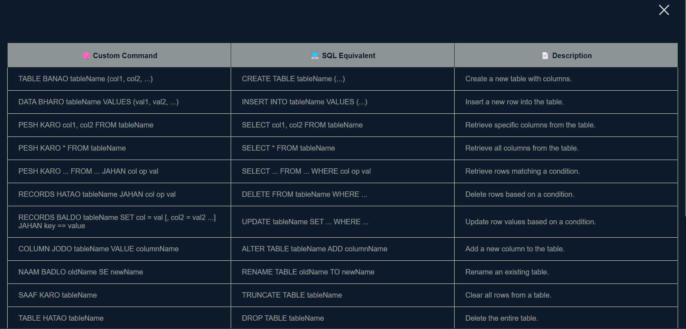
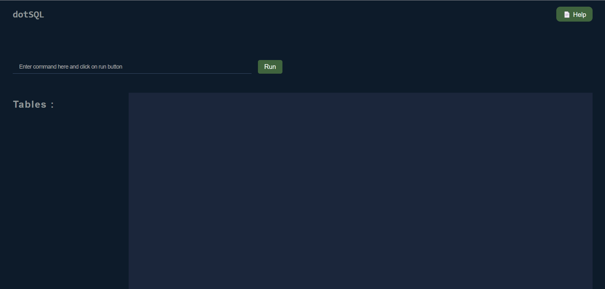

# ⚡ DotSQL – Custom Mini Database Fun Project

DotSQL is a lightweight, browser-based mini database fun project that lets you create, manage, and query in-memory tables using a fun and intuitive Hindi-English hybrid language. It's perfect for learning basic database operations, experimenting with custom syntax.

---

## Table of Content

[🔥Features](#features)
[🛠️ Used Technologies](#️-used-technologies)
[🔗 Live Preview](#-live-preview)
[📸 Previews](#-previews)
[📘 DotSQL References](#-dotsql-references)
[🧠 How to Use](#-how-to-use)
[🚀 Installation](#-installation)
[🤝 Contribution](#-contribution)
[📜  MIT License](#-license)
[👨‍💻 About the Creator](#-about-the-creator)
[📬 Connect with Me](#-connect-with-me)


## 🔥Features

- 🌐 Works fully in the browser — no server or setup required
- 😍 Uses simple Hindi-English hybrid commands
- 💡 Great for beginners and educational demos
- ⚙️ Covers full CRUD operations
- 🧠 Supports command help (`MADAD`)
- 📤 Export tables (CSV) and full database (JSON)
- 🧪 Built with clean JavaScript and regex parsing

---

## 🛠️ Used Technologies

- **HTML & CSS** : For making UI
- **Javascript** : For making Logics for commands, and other functions.

---

## 🔗 Live Preview

> You can access this project by clicking this [link](https://dothp-harshu.github.io/dotSQL/ "Click").

---

## 📸 Previews




---

## 📘 DotSQL References

### Supported Commands

| 🧠 Custom Command                                        | 💻 SQL Equivalent                              | 📄 Description                                     |
| -------------------------------------------------------- | ---------------------------------------------- | -------------------------------------------------- |
| `TABLE BANAO tableName (col1, col2, ...)`                | `CREATE TABLE tableName (...)`                 | Create a new table with specified columns.         |
| `DATA BHARO tableName VALUES (val1, val2, ...)`          | `INSERT INTO tableName VALUES (...)`           | Insert a row of data into the table.               |
| `PESH KARO * FROM tableName`                             | `SELECT * FROM tableName`                      | Select all columns from the table.                 |
| `PESH KARO col1, col2 FROM tableName`                    | `SELECT col1, col2 FROM tableName`             | Select specific columns from the table.            |
| `PESH KARO ... FROM ... JAHAN col op val`                | `SELECT ... FROM ... WHERE ...`                | Select rows with condition (`==`, `!=`, `>`, etc). |
| `RECORDS HATAO tableName JAHAN col op val`               | `DELETE FROM tableName WHERE ...`              | Delete rows matching the condition.                |
| `RECORDS BALDO tableName SET col = val JAHAN key == val` | `UPDATE table SET col = val WHERE ...`         | Update specific cells in a row.                    |
| `COLUMN JODO tableName VALUE newColumn`                  | `ALTER TABLE tableName ADD newColumn`          | Add a new column to an existing table.             |
| `NAAM BADLO oldName SE newName`                          | `RENAME TABLE oldName TO newName`              | Rename a table.                                    |
| `SAAF KARO tableName`                                    | `TRUNCATE TABLE tableName`                     | Clear all rows from a table.                       |
| `TABLE HATAO tableName`                                  | `DROP TABLE tableName`                         | Delete a table entirely.                           |
| `COPY BANAO tableName AS newTableName`                   | `CREATE TABLE newTable AS SELECT * FROM table` | Clone a table with its structure and data.         |
| `BHEJO DATABASE`                                         | _Export entire DB_                             | Download the full database as JSON.                |
| `BHEJO TABLE tableName`                                  | _Export table_                                 | Download a specific table as CSV.                  |
| `BACKUP LO`                                              | _Save backup_                                  | Save database to localStorage as a backup.         |
| `RESTORE KARO`                                           | _Restore backup_                               | Load database from saved backup.                   |
| `DATABASE HATAO`                                         | _DROP DATABASE_                                | Delete entire database after confirmation.         |
| `MADAD CHAHIYE`                                          | _Help command_                                 | Show this command reference inside the app.        |

### 🧪 Supported Condition Operators

| Operator | Meaning               |
| -------- | --------------------- |
| `==`     | Equal to              |
| `!=`     | Not equal to          |
| `>`      | Greater than          |
| `<`      | Less than             |
| `>=`     | Greater than or equal |
| `<=`     | Less than or equal    |

---

## 🧠 How to Use

🖱️ Type your custom command in the input box
🧪 Click "Run" or press Enter
📊 View the output table immediately
💾 Use BHEJO DATABASE or BHEJO TABLE to download your data

---

## 🚀 Installation 

1. Navigate to the project directory:

```bash
cd project-name
```

2. Clone the repository

```bash
git clone https://github.com/dothp-harshu/dotSQL.git
```

3. Open `index.html`

4. For import sample data on the database run on brower's console (optional):

```js
localStorage.setItem("database", JSON.stringify(tempData));
```

--

## 🤝 Contribution

> Contributions and ideas are welcome! Feel free to submit pull requests or open issues for improvements, new features, or new commands.


---

## 📜 License

This project is licensed under the [MIT License](LICENSE).


---

## 👨‍💻 About the Creator

This project was built with ❤️, creativity, and a fun twist by someone who believes coding should be **fun**, **intuitive**, and **relatable**. **DotSQL** reimagines database queries in a way that feels like speaking your own language.

Whether you're a student, developer, or curious explorer, I hope this project brings clarity, confidence, and maybe even a chuckle.

---

## 📬 Connect with Me

- 🌐 Portfolio: [Portfolio](https://dothp-harshu.github.io/portfolio)
- 🐙 GitHub: [dotHP-harshu](https://github.com/dothp-harshu)
- 📧 Email: [dothp.harsh@gmail.com](mailto:dothp.harsh@gmail.com)
- 💬 LinkedIn: [linkedin.com/in/dothp](https://linkedin.com/in/dothp)

---

>Made with ❤️ by **DotHP**
